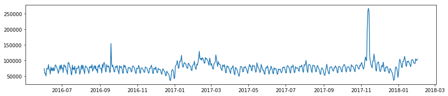
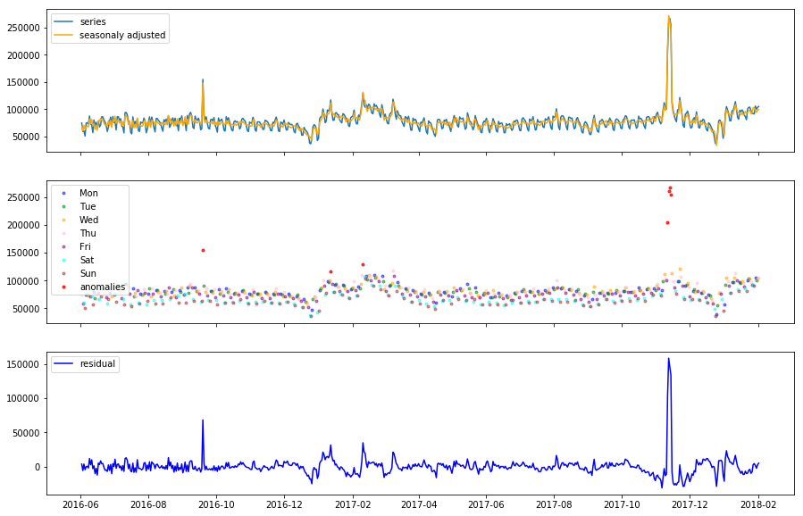
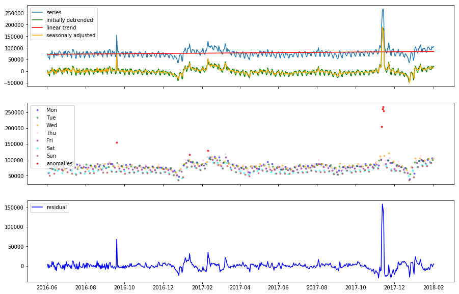
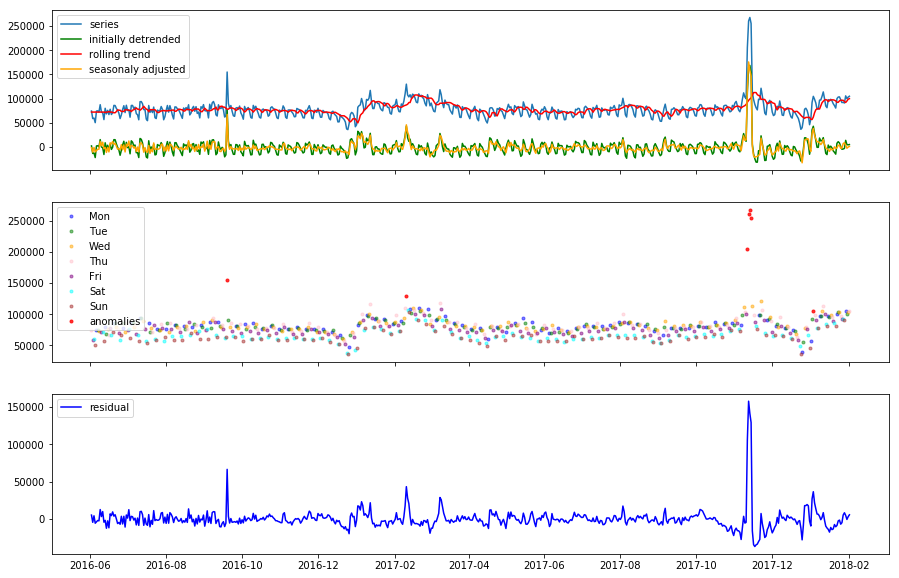

# Anomaly

Anomaly accepts a pandas DateTimeIndexed series with one day per row, and detects outliers in the data.


```python
import pandas as pd
import matplotlib.pyplot as plt

series = pd.read_csv('../data/test.csv', squeeze=True, index_col=0, parse_dates=True)
fig = plt.figure(figsize=(15, 3))
plt.plot(series.values)
```


    [<matplotlib.lines.Line2D at 0x220ed13fdd8>]





```python
import anomaly

detector = anomaly.AnomalyDetector(series)
detector.fit()
detector.plot()
```





```python
detector.indices
```


    array([528, 529, 530, 527, 109, 253, 224], dtype=int64)


## Installation

    pip install git+https://github.com/adammarples/anomaly.git

## Methodology

Most of the KPIs related to web analytics have a strong weekly pattern, and outlier detection will depend on first extracting the weekly seasonality. This is acheived with the python library seasonal https://github.com/welch/seasonal.

When the weekly seasonal data is removed from the signal, the overall trend is also removed and only the residual is left. The outlier detection is then done on the residual signal.

Outlier detection is acheived with the Smirnov-Grubbs test.

## Further Usage

If there is further seasonality in the data, for example yearly, the adjusted series can be run through again using a different detection period to further deseasonalise the data. 


```python
new_series = detector.adjusted

detector = anomaly.AnomalyDetector(new_series)
detector.fit(period=365)
```

### Preprocessing Detrending

The data can also be de-trended using a linear regression or a rolling median average before fitting


```python
detector.detrend(how='linear')
detector.fit()
detector.plot()
```





```python
detector.detrend(how='rolling')
detector.fit()
detector.plot()
```





## Helper function

There is a helper function to apply the default detection to a series using pandas.Series.transform


```python
from anomaly import detect_anomalies

series.transform(detect_anomalies)
```


    array([False, False, False, False, False, False, False, False, False,
           False, False, False, False, False, False, False, False, False,
           False, False, False, False, False, False, False, False, False,
           False, False, False, False, False, False, False, False, False,
           False, False, False, False, False, False, False, False, False,
           False, False, False, False, False, False, False, False, False,
           False, False, False, False, False, False, False, False, False,
           False, False, False, False, False, False, False, False, False,
           False, False, False, False, False, False, False, False, False,
           False, False, False, False, False, False, False, False, False,
           False, False, False, False, False, False, False, False, False,
           False, False, False, False, False, False, False, False, False,
           False,  True, False, False, False, False, False, False, False,
           False, False, False, False, False, False, False, False, False,
           False, False, False, False, False, False, False, False, False,
           False, False, False, False, False, False, False, False, False,
           False, False, False, False, False, False, False, False, False,
           False, False, False, False, False, False, False, False, False,
           False, False, False, False, False, False, False, False, False,
           False, False, False, False, False, False, False, False, False,
           False, False, False, False, False, False, False, False, False,
           False, False, False, False, False, False, False, False, False,
           False, False, False, False, False, False, False, False, False,
           False, False, False, False, False, False, False, False, False,
           False, False, False, False, False, False, False, False,  True,
           False, False, False, False, False, False, False, False, False,
           False, False, False, False, False, False, False, False, False,
           False, False, False, False, False, False, False, False, False,
           False,  True, False, False, False, False, False, False, False,
           False, False, False, False, False, False, False, False, False,
           False, False, False, False, False, False, False, False, False,
           False, False, False, False, False, False, False, False, False,
           False, False, False, False, False, False, False, False, False,
           False, False, False, False, False, False, False, False, False,
           False, False, False, False, False, False, False, False, False,
           False, False, False, False, False, False, False, False, False,
           False, False, False, False, False, False, False, False, False,
           False, False, False, False, False, False, False, False, False,
           False, False, False, False, False, False, False, False, False,
           False, False, False, False, False, False, False, False, False,
           False, False, False, False, False, False, False, False, False,
           False, False, False, False, False, False, False, False, False,
           False, False, False, False, False, False, False, False, False,
           False, False, False, False, False, False, False, False, False,
           False, False, False, False, False, False, False, False, False,
           False, False, False, False, False, False, False, False, False,
           False, False, False, False, False, False, False, False, False,
           False, False, False, False, False, False, False, False, False,
           False, False, False, False, False, False, False, False, False,
           False, False, False, False, False, False, False, False, False,
           False, False, False, False, False, False, False, False, False,
           False, False, False, False, False, False, False, False, False,
           False, False, False, False, False, False, False, False, False,
           False, False, False, False, False, False, False, False, False,
           False, False, False, False, False, False, False, False, False,
           False, False, False, False, False, False, False, False, False,
           False, False, False, False, False, False, False, False, False,
           False, False, False, False, False, False, False, False, False,
           False, False, False, False, False,  True,  True,  True,  True,
           False, False, False, False, False, False, False, False, False,
           False, False, False, False, False, False, False, False, False,
           False, False, False, False, False, False, False, False, False,
           False, False, False, False, False, False, False, False, False,
           False, False, False, False, False, False, False, False, False,
           False, False, False, False, False, False, False, False, False,
           False, False, False, False, False, False, False, False, False,
           False, False, False, False, False, False, False, False, False,
           False, False, False, False, False, False, False])


